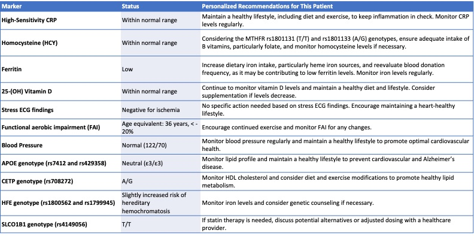
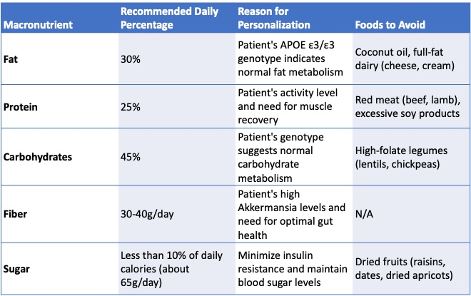

# Health Recommendation App

This is an initial prototype for an app that does this:

1. Let users enter or upload basic current health information, including any medications, supplements.  Also request information about medical history, including family history. Optionally let the user upload specific details like blood chemistry, genomics, microbiome, etc. 
3. Respond with general observations and recommendations. Point to any markers that might be out of range and suggest actions.
4. Ask about dietary preferences and current exercise levels. 
5. Propose general guidelines for daily macronutrient percentages (protein, carbs, etc.) and calories.
6. Propose additional tests that could reveal more in-depth information.

## Sample Output





## Install

Create a project directory and download everything from this repo.


### Frontend

You'll need Python

```sh
python3 -m venv venv
source venv/bin/activate
pip install -r ./backend/requirements.txt
```


### Backend

Requires `npm 9.5` and `node 18`

```sh
cd frontend/drr_frontend
npm install
```

### Environments

You'll need two `.env` files with your secret environment variables.

In the top directory:
```yml
23ANDME_EMAIL=youremail@whatever.com
23ANDME_PASSWORD=password
OPENAI_API_KEY=somelongapikey
```

In the frontend directory, you'll need to set whatever you want as the backend port

```yml
REACT_APP_BACKEND_URL=http://127.0.0.1:5005
```


## Run

Start the backend:

```sh
python backend/app.py
```

Start the frontend:

```sh
cd frontend/drr_frontend
npm start
```


