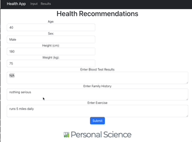

# Health Recommendation App

This is an initial prototype for an app that does this:

1. Let users enter or upload basic current health information, including any medications, supplements.  Also request information about medical history, including family history. Optionally let the user upload specific details like blood chemistry, genomics, microbiome, etc. 
3. Respond with general observations and recommendations. Point to any markers that might be out of range and suggest actions.
4. Ask about dietary preferences and current exercise levels. 
5. Propose general guidelines for daily macronutrient percentages (protein, carbs, etc.) and calories.
6. Propose additional tests that could reveal more in-depth information.



## Sample Output


## Docker

The easiest way to get started is to use [Docker](https://hub.docker.com/repositories/personalscience).  There are three Dockerfiles of interest:

1. docker-compose.yml
2. frontend/drr_frontend/Dockerfile
3. backend/Dockerfile


```sh
docker-compose up --build -d
```
Look over the docker-compose.yml file and adjust as required.


## Install

To generate everything from sources, first create a project directory and download everything from this repo.


### Backend

You'll need Python

```sh
python3 -m venv venv
source venv/bin/activate
pip install -r ./backend/requirements.txt
```

and now it will run on https://localhost:5005  (or whatever you set in `.env`).


### Backend

Requires `npm 9.5` and `node 18`

```sh
cd frontend/drr_frontend
npm install
```

You may have some trouble with compatibility among the components.  If so, do this instead:

```sh
 npm install --legacy-peer-deps
```

### Environments

You'll need two `.env` files with your secret environment variables.

In the top directory (these settings should work "out of the box" -- it'll still run in demo mode if you don't change these credentials):
```yml
23ANDME_EMAIL=youremail@whatever.com
23ANDME_PASSWORD=password
OPENAI_API_KEY=somelongapikey
REACT_APP_BACKEND_URL=http://0.0.0.0:5005
FLASK_RUN_HOST=0.0.0.0
FLASK_RUN_PORT=5005
DRR_DEMO_MODE=true
DRR_ASSET_PATH=/path/to/sample/files

```

In the frontend directory (frontend/drr_frontend/.env) , you'll need to set whatever you want as the backend port. In development I've generally been using `5005.

```yml
REACT_APP_BACKEND_URL=http://localhost:5005
```

In production, under a Docker environment, you'll want this to be
```yml
REACT_APP_BACKEND_URL=http://backend:5005
```

### VS Code

If you use VS Code, the `./vscode` directory contains various launch and task settings you might find useful.


## Run

Start the backend:

```sh
python backend/app.py
```

Start the frontend:

```sh
cd frontend/drr_frontend
npm start
```


